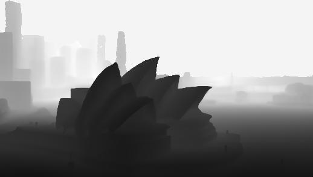
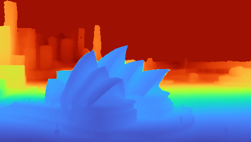

# Depth-Anything-V3 (DA3) 深度圖處理與分割技術

## 1. 基於直方圖峰值的深度量化 (Histogram Peak Quantization)

### 技術描述
在 `run_inference.py` 中，我們實作了 `quantize_by_peaks` 函式來對 16-bit 的連續深度圖進行降維與量化。其核心概念是利用「像素深度的統計分佈（直方圖）」來尋找畫面中最主要的幾個深度層級，進而達到初步的背景與前景分離效果。

具體處理步驟如下：
1. **計算直方圖 (Calculate Histogram)**：統計 16-bit 深度圖（0~65535）中每個深度值出現的頻率。
2. **平滑過濾 (Gaussian Smoothing)**：使用高斯模糊平滑直方圖曲線，避免因為微小雜訊產生假性峰值（Micro-peaks）。
3. **峰值提取與篩選 (Peak Finding & Filtering)**：找出直方圖上的局部最大值（Local Maxima），並依據頻率高低進行排序。為了確保分出來的區塊具有顯著差異，程式會強制設定峰值之間需保持最小距離（約佔全距的 7.6%）。若有效的獨立峰值不足，會自動平均補齊數量。
4. **像素映射 (LUT Mapping)**：建立一個查找表（Look-Up Table），計算原來 0~65535 的每一個深度區間最靠近哪一個篩選出的主要峰值，並將所有像素強制歸類（Snap）到最接近的峰值上。

**優點**：
* 實作簡單，利用 LUT 運算速度極快。
* 能迅速將連續漸層的深度畫面，依照絕對距離壓縮成指定的 N 個離散深度層次（例如：近景、中景、遠景）。

**缺點與限制**：
* 由於只依賴「絕對距離」進行全域的閾值分類，**完全忽略了空間連續性（Spatial Connectivity）與局部特徵**。
* 如果照片中有一個向遠處延伸的漸變表面（例如：地面、長廊、或側向的牆面），該獨立物件會因為深度跨越多個不同的梯級域，而被強行「切分」成多個斷層區塊，無法保持單一物件輪廓的完整性。

---

### 成果比較展示

以 `000` 測試樣本為例，觀察連續深度轉換為量化分層的效果差異：

#### 1. 原始連續深度圖

 *(說明：DA3 原始輸出的連續深度，表面深度變化平滑、細節完整)*

#### 2. 直方圖峰值量化結果 (設定 3 個層級)

 *(說明：套用 Peak Quantization 後，畫面被硬性切分為三個絕對距離層級。雖然成功分出大範圍的背景與前景，但原本連續的地面等單一實體物件遭到「斑馬紋式」的斷層切割)*

#### 3. 量化後追加高斯模糊 (Soft Transitions)

 *(說明：對上一階段的量化結果進行大核高斯模糊。雖然柔化了生硬的邊緣切線，讓視覺上不那麼突兀，但在物件辨識的本質上，尚未解決單一物件被拆分的問題)*
