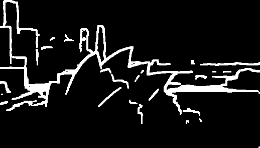
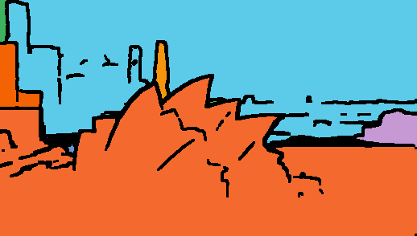

# Depth-Anything-V3 (DA3) 深度圖處理與分割技術

## 2. 基於深度斷層的物件分割 (Depth Edge / Sobel Segmentation)

### 技術描述
在 `run_inference.py` 中，我們移除了原本依賴「絕對距離」的直方圖分層法，改用「深度變化率（梯度）」來區分物體。這個 `segment_objects_by_depth_edges` 演算法的核心理念是：**連續的單一物體表面深度變化平緩，而不同物體的交界處必定伴隨著深度的劇烈落差（邊緣斷層）**。

具體處理步驟如下：
1. **深度轉浮點 (Float Conversion)**：將 16-bit 原生深度圖轉換為 `float32`，以確保梯度的運算精確度。
2. **計算深度梯度 (Sobel Gradient)**：使用 OpenCV 的 Sobel 運算子，分別算出影像在 X 軸與 Y 軸的深度變化率（偏微分），並結合為總梯度強度（Magnitude）。
3. **篩選邊緣斷層 (Edge Thresholding)**：找出梯度中變化最劇烈的前 10%（`magnitude_percentile = 90`），這代表了前後景遮蔽交界的「懸崖」，並對其進行二值化提取邊緣（Edges=白色）。
4. **填補縫隙與反轉 (Dilation & Inversion)**：將找出的邊緣稍微膨脹閉合，確保能完美框住空間區域而不會破洞。然後將顏色反轉，讓平滑的內部表面變為白色，邊界斷層變為黑色。
5. **連通區塊標記 (Connected Components)**：最後利用 `cv2.connectedComponents`，將每一塊被「黑色邊緣」包圍住的白色「平滑盆地區域」貼上不同的 ID 標籤，達成獨立物體的精確分割。

**優點**：
* 完美解決了漸層延伸物體（如傾斜路面、牆面）被強制「切斷」的問題，這類物體現在能保持單一的塊面。
* 不需要依賴重型的影像分割模型（如 SAM），就能在不到 0.1 秒極短時間內，只靠純幾何與深度資訊切分出實體物件。

**缺點與參數依賴**：
* 這個方法很依賴 `magnitude_percentile` 參數的設定。如果設太低（太靈敏），會把一點點深度變化都當作邊界，產生許多破片；如果設太高（太遲鈍），景深落差不夠大的兩個獨立物體就會被黏在一起，無法分開。

---

### 成果比較展示

以 `000` 測試樣本為例，最新分割演算法的效果：

#### 1. 深度邊緣斷層擷取 (Depth Edges)

 *(說明：黑底白線。白線精準描繪出了因為前後景距離不同而發生的深度劇烈變化。只要有物體與物體的交疊，就會有一條白色的輪廓線出現。)*

#### 2. 連通區塊獨立上色 (Colorized Segments)

 *(說明：系統沿著上述的邊界，把圖框裡的每一塊獨立連續空間塗上不同的隨機色彩。這張圖裡可以清楚看到，地面的長廊已經不再如之前被生硬切斷，它完美保留了自身「表面連續」的幾何特徵。)*
