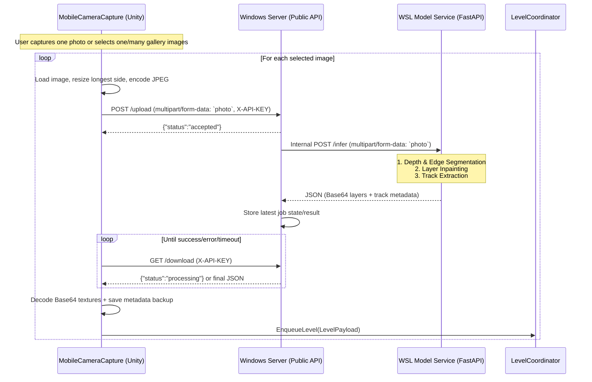

# SkateboardP Monorepo - AI Context Document

> **For AI Assistants:** This README is designed to give you a rapid, high-level understanding of the architecture, data flow, and file layout of this monorepo. Please read this before modifying cross-boundary code.

## 1. Project Overview
This project implements a **photo-to-playable-level pipeline** for a Unity skateboard game. 
- **Input:** A real-world 2D image captured by a mobile device.
- **Processing:** Depth extraction, semantic segmentation, occlusion inpainting, and track path generation.
- **Output:** A JSON payload containing Base64 encoded layered images (foreground/gameplay/background) and 2D track points that Unity procedurally generates into a 3D playable level.

---

## 2. Monorepo Architecture

This repository contains multiple interconnected environments (C# & Python) running across different operating systems (Windows & Linux/WSL).

### `wsl-cv/` (WSL / Linux - Python)
**Role:** The core Computer Vision backend. 
- **Tech Stack:** Python 3.10+, PyTorch, FastAPI, `uv` for dependency management.
- **Key Flow:** Exposes a `POST /infer` endpoint. Uses `Depth Anything 3` (in `models/depth_anything_3`) to extract depth, then runs custom legacy scripts (`scripts/run_inference_sobal.py`, `scripts/cut_img.py`, `scripts/extract_track.py`) in isolated subprocess sandbox directories (`_jobs/`).
- **Important:** Do NOT modify `models/depth_anything_3` as it is vendor code. Look at `wsl-cv/README.md` for specific CV details.

### `win-server/` (Windows - Python)
**Role:** The Gateway Server.
- **Tech Stack:** Python (Likely Flask/FastAPI).
- **Purpose:** Exposes a public endpoint for the mobile Unity client. Since the WSL backend cannot easily expose ports to the external network, this Windows server receives the request, routes it via `localhost`/internal call to the WSL API, and proxies the JSON payload back to the client.

### `unity_client/` (Windows/Mobile - C#)
**Role:** The Game Client Connection & Generation Scripts.
- **Tech Stack:** Unity (C#).
- **Purpose:** Contains **only** the connection and level generation scripts extracted from the main Unity project. It is *not* the entire Unity game repository. `MobileCameraCapture.cs` handles capturing photos, sending them to `win-server`, and decoding the returned Base64/JSON. It then hands off the payload to other generation scripts (like `LevelCoordinator`) to actually instantiate the physical gameplay objects.

### `_legacy_2d/` (Archive)
**Role:** Deprecated/Old experiments for 2D track generation. Do not reference unless specifically asked.

---

## 3. Data Transmission Pipeline

When modifying API contracts, note that data traverses three distinct boundaries. The active Unity client is
`unity_client/MobileCameraCapture.cs`; `MobileCameraCapture_old.cs` is kept only as a reference for the older
single-image flow.

`MobileCameraCapture.cs` supports taking one camera photo or selecting one or more gallery images. For multiple
gallery images, Unity does **not** send one multipart request containing many files. It processes the selected
paths one at a time: resize/encode the image, upload it as the `photo` field, poll for that image's result, enqueue
the returned level payload, then continue with the next image.



Important runtime details:
- Unity still uses the field name `photo` for every upload. Batch selection is a client-side loop, not a backend
  batch endpoint.
- `win-server/server.py` keeps a single global job state (`idle`, `processing`, `success`, `error`). The current
  Unity script avoids overlapping uploads by processing images sequentially.
- `MobileCameraCapture.cs` calls `LevelCoordinator.EnqueueLevel(payload)` for each successful response. The old
  reference script called `ApplyPayload(payload)` and handled only one image at a time.
- Metadata is backed up to `Application.persistentDataPath/schema_XX.json` for each batch item, and also to
  `schema.json` for compatibility with the older single-result behavior.

### JSON Payload Contract (WSL -> Win -> Unity)
The CV backend returns the following structure:
```json
{
  "foreground_base64": "<base64_string>",
  "gameplay_base64": "<base64_string>",
  "background_base64": "<base64_string>",
  "metadata": {
    "points": [ [x1, y1], [x2, y2] ],
    "aspect_ratio": 1.7778,
    "timestamp": "..."
  }
}
```
*(Note: Refer to `wsl-cv/api_contract.md` for details on future payload refactoring goals).*

---

## AI Guidelines for this Repo
1. **Cross-Platform Awareness:** Assume path operations in `wsl-cv/` use Linux conventions, while `win-server/` uses Windows. 
2. **Subprocess Orchestration:** The `wsl-cv/scripts/infer.py` orchestrates the pipeline using string manipulation and `subprocess.run`. Be extremely careful when changing directory structures as it breaks hardcoded paths.
3. **Dependency Management:** Use `uv` for Python dependency management in the `wsl-cv` project.
